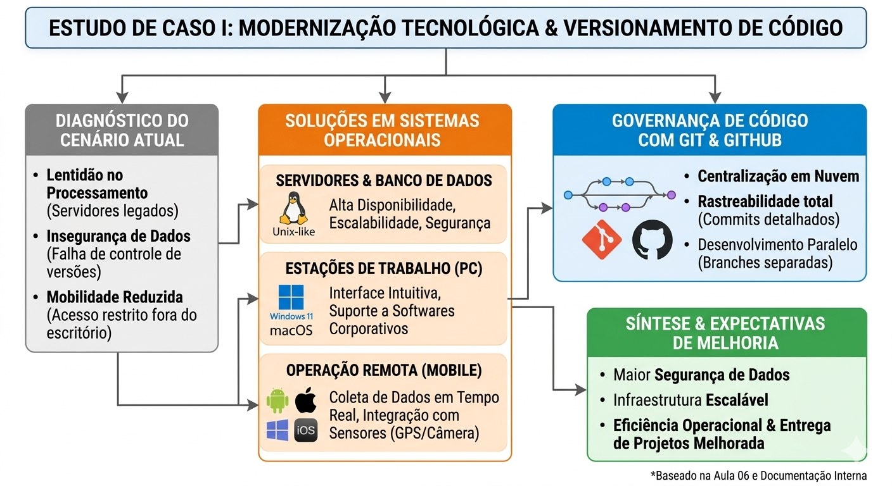

# PLANEJAMENTO ESTRATÉGICO DE INFRAESTRUTURA TECNOLÓGICA
## Estudo de Caso: Modernização dos Ambientes da DevStore

---

**Disciplina:** Sistemas Operacionais  
**Acadêmico:** Gustavo Henrique Mota Lima 
**Professor:** Prof.  Deivison S. Takatu  

---

## 1. Sumário Executivo

Este documento detalha o plano de reestruturação para a DevStore, uma startup de desenvolvimento web que atualmente opera sob um modelo de infraestrutura legado. O diagnóstico aponta que a dependência de servidores físicos locais e a inexistência de paridade entre ambientes (desenvolvimento, teste e produção) são os principais impedimentos para o crescimento da empresa. 

A solução proposta foca na transição para uma arquitetura baseada em nuvem, utilizando virtualização e containers para garantir portabilidade, segurança e escalabilidade horizontal.

---

## 2. Diagnóstico da Situação Atual

A análise técnica revelou três pilares de vulnerabilidade na DevStore:

* **Rigidez de Hardware:** O uso de servidores locais sem padronização eleva o custo de manutenção e impede a rápida expansão de recursos conforme a demanda dos clientes.
* **Gargalos no Ciclo de Vida do Software:** A ausência de ambientes de homologação isolados gera o risco de falhas críticas serem detectadas apenas em produção, afetando a experiência do usuário final.
* **Exposição e Riscos de Dados:** A falta de políticas de controle de acesso (IAM) e de monitoramento sistêmico torna a infraestrutura suscetível a ataques externos e falhas operacionais não detectadas em tempo real.

---

## 3. Diretrizes da Arquitetura Proposta

A nova infraestrutura será fundamentada na **abstração de recursos**, permitindo que o software seja independente do hardware físico.

### 3.1. Containerização (Agilidade e Padronização)
A implementação do Docker permitirá que cada aplicação seja "empacotada" com todas as suas dependências. Isso elimina o erro comum de incompatibilidade entre a máquina do desenvolvedor e o servidor, garantindo que o sistema funcione de forma idêntica em qualquer nó da rede.

### 3.2. Virtualização e Isolamento
Diferente dos containers, as máquinas virtuais (VMs) serão utilizadas em cenários específicos onde o isolamento total do kernel do sistema operacional seja necessário, especialmente para testes de segurança e execução de serviços legados que exigem bibliotecas de SO específicas.

### 3.3. Computação em Nuvem (Elasticidade)
A migração para provedores de nuvem (AWS ou Azure) permitirá que a DevStore utilize o modelo de pagamento por uso (*Pay-as-you-go*). Isso garante que, em períodos de alto tráfego, a infraestrutura se expanda automaticamente (Auto-scaling).

---

## 4. O Papel Central do Sistema Operacional (SO)

Nesta nova estrutura, o Sistema Operacional deixa de ser apenas uma interface e passa a ser o gestor crítico de recursos distribuídos:

* **No Desenvolvimento:** O SO local atua como hospedeiro para motores de containerização, gerenciando memória e CPU para múltiplos microserviços.
* **Na Produção:** Utilizaremos distribuições Linux de nível corporativo (como Ubuntu Server ou Amazon Linux), otimizadas para segurança e alta performance, focando na estabilidade do kernel e na execução eficiente de processos em background.
* **Na Segurança:** O SO será configurado com permissões restritas (Princípio do Menor Privilégio), onde cada serviço possui acesso apenas aos arquivos e portas de rede estritamente necessários.

---

## 5. Fluxo de Operação e Entrega

O fluxo proposto substitui o deploy manual por um pipeline estruturado:
1.  **Desenvolvimento:** Código criado em containers Docker locais.
2.  **QA (Testes):** Execução automática em ambientes virtualizados para validação de performance e segurança.
3.  **Produção:** Deploy automatizado em instâncias de nuvem, monitoradas por ferramentas de observabilidade em tempo real.

---

## 6. Análise de Investimento e Custos

A comparação abaixo reflete a mudança do modelo de custo fixo (CAPEX) para custo variável (OPEX).

### Comparativo Técnico-Econômico

| Critério | Servidores Físicos (Local) | Nuvem Gerenciada (Proposta) |
| :--- | :--- | :--- |
| **Custo de Entrada** | Alto (Compra de Equipamentos) | Baixo (Provisionamento sob demanda) |
| **Escalabilidade** | Manual e Demorada | Automática e Instantânea |
| **Disponibilidade** | Depende de No-breaks e infra local | 99.9% garantido pelo provedor (SLA) |
| **Fim de Vida (EOL)** | Hardware torna-se obsoleto | Atualização transparente pelo provedor |

**Projeção Mensal (2026):**
* **Modelo Local:** R$ 1.200 a R$ 2.500 (Estimativa de energia, manutenção e depreciação).
* **Modelo Cloud:** R$ 450 a R$ 1.900 (Baseado no consumo efetivo de instâncias t3.medium e armazenamento SSD).

---

## 7. Conclusão

A transição da DevStore para uma infraestrutura moderna baseada em containers e nuvem não é apenas uma atualização técnica, mas uma necessidade estratégica. Esta mudança reduzirá o tempo de entrega de novas funcionalidades, aumentará a resiliência contra falhas e permitirá que a startup compita em pé de igualdade com grandes players do mercado, focando no desenvolvimento de software e não na gestão de hardware.

---

## 8. Referências Bibliográficas

* SILBERSCHATZ, Abraham. **Sistemas Operacionais com Java**.
* Documentação Técnica: **Docker Engine & Kubernetes Concepts**.
* Guia de Melhores Práticas: **AWS Well-Architected Framework**.

