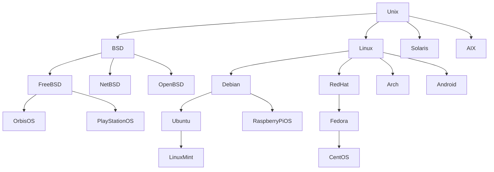
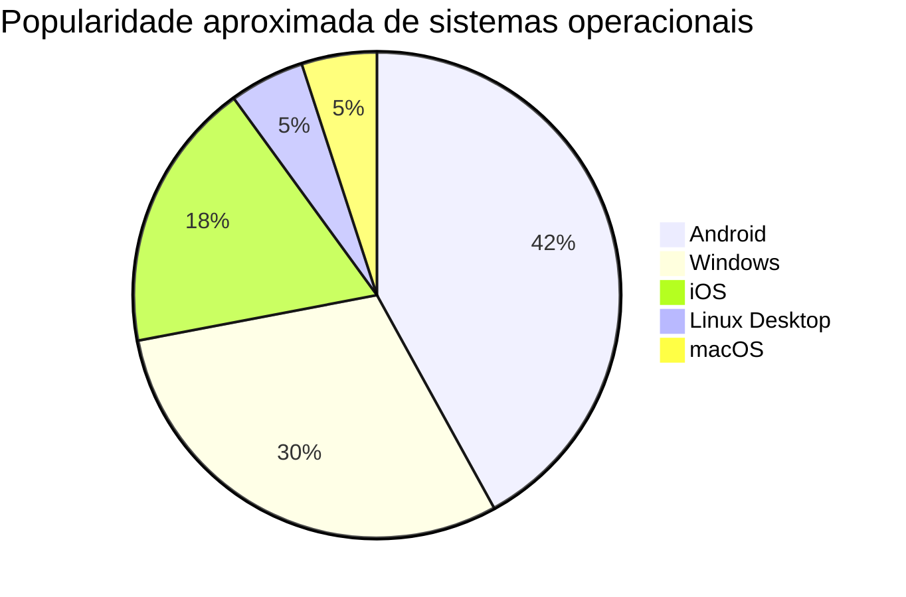

# 🖥️ Sistemas Operacionais Derivados

### Estrutura e Arquitetura de Sistemas Operacionais

---

# 😂 Começando com um meme

> “Vou criar meu próprio sistema operacional… com jogos e interface gráfica!”

---

<h2 style="color:white;">📚 Introdução</h2>

Os **Sistemas Operacionais (SO)** são responsáveis por gerenciar o hardware do computador e permitir a execução de programas.

Criar um sistema operacional completo é uma tarefa extremamente complexa.
Por esse motivo, muitos sistemas modernos são desenvolvidos **a partir de outros sistemas já existentes**, reutilizando componentes importantes como:

<ul>
<li>Kernel</li>
<li>Sistema de arquivos</li>
<li>Gerenciamento de memória</li>
<li>Drivers de hardware</li>
</ul>

Essa prática reduz o tempo de desenvolvimento e aumenta a estabilidade do sistema.

---

# 🧬 Árvore COMPLETA dos Sistemas Operacionais

---

# 🕰️ Linha do Tempo da Evolução

| Ano  | Evento                             |
| ---- | ---------------------------------- |
| 1969 | Criação do UNIX                    |
| 1991 | Linus Torvalds cria o Kernel Linux |
| 1993 | Lançamento do Debian               |
| 2004 | Ubuntu é lançado                   |
| 2006 | Linux Mint é criado                |
| 2008 | Lançamento do Android              |
| 2013 | PlayStation 4 utiliza Orbis OS     |

---

# 📊 Popularidade de Sistemas Operacionais

> Valores aproximados considerando uso global em dispositivos.

---

# 🖥️ Sistemas Operacionais Pesquisados

---

## 🐧 Ubuntu

<b>Sistema Base:</b> Debian Linux

O **Ubuntu** é uma das distribuições Linux mais populares do mundo, criada para tornar o Linux mais acessível ao público geral.

<h3 style="color:white;">Características</h3>

<ul>
<li>Interface amigável</li>
<li>Atualizações frequentes</li>
<li>Grande comunidade</li>
<li>Muito utilizado em servidores</li>
</ul>

---

## 🍃 Linux Mint

<b>Sistema Base:</b> Ubuntu → Debian → Linux Kernel

O **Linux Mint** foi desenvolvido para oferecer uma experiência mais simples e tradicional de desktop.

<h3 style="color:white;">Características</h3>

<ul>
<li>Interface intuitiva</li>
<li>Ótimo desempenho</li>
<li>Ideal para iniciantes</li>
</ul>

---

## 🍓 Raspberry Pi OS

<b>Sistema Base:</b> Debian Linux

Sistema desenvolvido para o computador educacional **Raspberry Pi**.

<h3 style="color:white;">Características</h3>

<ul>
<li>Sistema leve</li>
<li>Usado em robótica</li>
<li>Muito utilizado em educação</li>
</ul>

---

## 🎮 Orbis OS

<b>Sistema Base:</b> FreeBSD

Sistema operacional utilizado no **PlayStation 4**.

<h3 style="color:white;">Características</h3>

<ul>
<li>Otimizado para jogos</li>
<li>Sistema proprietário</li>
<li>Adaptado ao hardware do console</li>
</ul>

---

## 🤖 Android

<b>Sistema Base:</b> Linux Kernel

Sistema operacional mobile mais utilizado do mundo.

<h3 style="color:white;">Características</h3>

<ul>
<li>Utilizado em bilhões de smartphones</li>
<li>Grande ecossistema de aplicativos</li>
<li>Código parcialmente aberto</li>
</ul>

---

# 📊 Comparação

| Sistema         | Sistema Base | Área de Uso          | Destaque                    |
| --------------- | ------------ | -------------------- | --------------------------- |
| Ubuntu          | Debian       | Desktop / Servidores | Interface amigável          |
| Linux Mint      | Ubuntu       | Desktop              | Fácil para iniciantes       |
| Raspberry Pi OS | Debian       | Educação / IoT       | Sistema leve                |
| Orbis OS        | FreeBSD      | Console              | Otimizado para jogos        |
| Android         | Linux Kernel | Mobile               | Sistema mais usado do mundo |

---

# 🎬 GIF Linux

---

# 😂 Meme Final

---

<h2 style="color:white;">📌 Conclusão</h2>

Grande parte dos sistemas operacionais modernos são derivados de outros sistemas já existentes.
Essa estratégia permite acelerar o desenvolvimento e garantir maior estabilidade.

Assim, os sistemas atuais fazem parte de uma **grande árvore evolutiva da tecnologia**, onde diferentes sistemas compartilham estruturas e arquiteturas semelhantes.

---

# 📚 Referências

* Tanenbaum – Sistemas Operacionais Modernos
* Silberschatz – Fundamentos de Sistemas Operacionais
* Documentação Linux
* Documentação Android
* Documentação FreeBSD

---

### 👨‍💻 Trabalho Acadêmico

Disciplina: **Estrutura e Arquitetura de Sistemas Operacionais**

Aluno: **Seu Nome**

